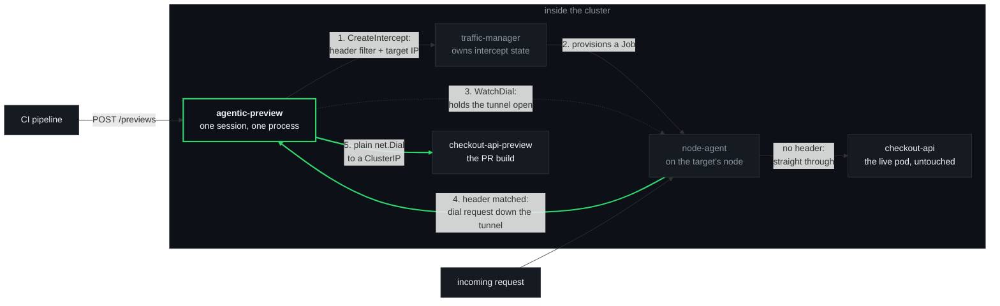

<p align="center">
  
</p>

<p align="center">
  <a href="#licence"></a>
  
  
</p>

---

`agentic-preview` raises header-routed [Telepresence](https://www.telepresence.io/)
previews from an HTTP call: POST it a work id and a Service, and every request carrying
that header value reaches the preview instead of the live pod. It runs as an ordinary
Deployment inside the cluster — no Telepresence CLI, no connector daemon, no TUN device,
no root, no laptop, and no human in the loop.

Full design notes and measured behaviour: **[`docs/DESIGN.md`](docs/DESIGN.md)**.

---

## The problem it solves

CI builds a pull request. Now someone has to look at it, in a system that means anything —
which means the change has to sit *inside* a real cluster, talking to the real services
around it.

The usual answers are all bad in the same way. Give the branch its own namespace and you
have cloned a whole estate to look at one service. Give it its own ingress hostname and
everything downstream still points at live. Wait for a shared staging slot and only one
change can be in flight at a time.

Header routing is the answer that scales: leave everything live, and divert *only* requests
carrying a chosen header to the changed service. Telepresence already does exactly this —
but through a CLI that runs on a developer's laptop, holding a session over a TUN device
and needing root to do it. A pipeline cannot drive that. So it stays a manual, interactive,
one-person-at-a-time tool.

`agentic-preview` is the same mechanism with the laptop taken out. One `POST` from a
pipeline step and the header is live; one `DELETE` when the PR merges and it is gone.

**And it holds a change together across repositories.** A work id — whatever id your issue
tracker gives one piece of work — is the primary key *and* the header value. The API, the
worker and a shared library land as three separate PRs, each joining the same work id as it
builds, and one header reaches all three. That is the thing a PR number cannot do.

## How it works

**Start with the one design fact, because nothing else makes sense without it.**

`InterceptSpec.target_host` reads like an address the traffic-agent connects to. **It is
not. The agent never dials it.**

For each intercepted request, the traffic-agent opens a tunnel back to the *client session*
and sends the destination down it as part of the connection ID. The dial happens at the
**client's** end, with a plain `net.Dial`. So the destination of a preview is not a value
you hand the manager — it is *a process holding a session and answering dial requests*.

That is the whole trick. Put that process **in the cluster** and its `net.Dial` reaches any
ClusterIP. The laptop, the TUN device and the root privileges were never about routing —
they were only ever about getting a dial to the right side of the network. In-cluster,
there is nothing to tunnel *to*; you are already there.

Two consequences fall straight out of it:

- **It must be long-lived.** A one-shot API call cannot be the far end of a tunnel. The
  service holds one manager session for its whole life, and every preview reconciles onto
  that session.
- **`target_host` must be a literal IP.** The agent parses it with `iputil.ParseAddr` and
  fails the intercept on a name, so agentic-preview resolves the preview Service by DNS
  itself before creating the intercept.



Step 5 is the one worth re-reading. The dial to the preview happens *in agentic-preview's
own process*, from inside the cluster — which is why no tunnelling, no routing table and
no privilege is involved anywhere.

## Feature map

```mermaid
flowchart TB
    ROOT(["agentic-preview"])

    ROOT --> R
    ROOT --> D
    ROOT --> L
    ROOT --> S
    ROOT --> O

    subgraph R["Routing"]
        direction TB
        R1["One header reaches<br/>a whole change"]
        R2["Many services per id,<br/>joined as each PR builds"]
        R3["Header name is service<br/>config, not per-request"]
        R4["Two work ids, one<br/>workload, at once"]
    end

    subgraph D["Durability"]
        direction TB
        D1["Survives a target-pod<br/>rollout"]
        D2["Survives a manager<br/>restart"]
        D3["Re-raises previews onto<br/>a rebuilt session"]
        D4["One tunnel per agent pod,<br/>not per preview"]
    end

    subgraph L["Lifecycle"]
        direction TB
        L1["POST is idempotent:<br/>retries are safe"]
        L2["SIGTERM removes every<br/>intercept first"]
        L3["Orphan sweep from the<br/>manager's own error"]
        L4["Drop one service, or<br/>a whole work id"]
    end

    subgraph S["Safety"]
        direction TB
        S1["Allow-list bounds intercept<br/>AND forward target"]
        S2["Bearer SA token,<br/>re-read every call"]
        S3["Session credential for<br/>a verified WatchDial"]
        S4["ClusterIP only, distroless<br/>nonroot, read-only rootfs"]
    end

    subgraph O["Operability"]
        direction TB
        O1["/readyz reports session<br/>and every tunnel"]
        O2["Refusals name the field<br/>to fix"]
        O3["No Kubernetes API access<br/>beyond its token"]
        O4["One static binary:<br/>20 MB, 35 MB image"]
    end

    classDef root fill:#0d1117,stroke:#32d46d,stroke-width:3px,color:#f0f3f6
    classDef leaf fill:#161b22,stroke:#30363d,stroke-width:1px,color:#f0f3f6
    class ROOT root
    class R1,R2,R3,R4,D1,D2,D3,D4,L1,L2,L3,L4,S1,S2,S3,S4,O1,O2,O3,O4 leaf
    style R fill:#0d1117,stroke:#32d46d,stroke-width:2px,color:#32d46d
    style D fill:#0d1117,stroke:#32d46d,stroke-width:2px,color:#32d46d
    style L fill:#0d1117,stroke:#32d46d,stroke-width:2px,color:#32d46d
    style S fill:#0d1117,stroke:#32d46d,stroke-width:2px,color:#32d46d
    style O fill:#0d1117,stroke:#32d46d,stroke-width:2px,color:#32d46d
```



## How to deploy it

**Prerequisite:** a Telepresence traffic-manager already running in the cluster, v2.30.0 or
later. The node-agent reconciler that makes a preview survive a target-pod rollout landed
in v2.30.0; earlier managers will raise an intercept but lose it on the first roll.
agentic-preview does not install Telepresence — see
[the Telepresence install docs](https://www.telepresence.io/docs/install/manager).

**1. Build and push the image.**

```bash
docker build -t registry.example.com/agentic-preview:$(date +%Y%m%d).01 .
docker push  registry.example.com/agentic-preview:$(date +%Y%m%d).01
```

A static binary on `distroless/static-debian12:nonroot`. The Telepresence dependency is
pinned to an exact commit in `go.mod` and fetched from the module proxy, so no local
Telepresence checkout is needed.

**2. Replace the four placeholders in `deploy/`.** They are listed, with what each one is
and where it appears, in the header comment of
[`deploy/kustomization.yaml`](deploy/kustomization.yaml):

| Placeholder | Replace with |
| :--- | :--- |
| `telepresence` | The namespace your traffic-manager runs in — `kubectl get deploy -A \| grep traffic-manager` |
| `shop` | Each namespace agentic-preview may intercept in and forward to |
| `registry.example.com/agentic-preview` | Where you pushed the image |
| `agentic-preview` (namespace) | Where the service itself should run, if not there |

`shop` and `checkout-api` throughout this repo are a **fictional example service**, not a
default worth keeping.

Two of those placeholders have to stay in step with each other for the life of the deploy:
the attach Roles in `deploy/rbac.yaml` and `ALLOWED_NAMESPACES` in
`deploy/deployment.yaml` must name the same set of namespaces. The reason is in
[Honest limits](#honest-limits) and it matters.

**3. Apply it.**

```bash
kubectl apply -k deploy/
kubectl -n agentic-preview rollout status deploy/agentic-preview
```

It is ready only once a manager session exists, so a green `/readyz` means it can actually
raise something:

```bash
kubectl -n agentic-preview port-forward svc/agentic-preview 8080:80
curl -sS localhost:8080/readyz
```

## How to call it

```
POST   /previews                                  add one service to a work id
GET    /previews                                  every work id and what it spans
GET    /previews/{workId}                         one work id's service set
DELETE /previews/{workId}/{namespace}/{workload}  that repo's PR merged
DELETE /previews/{workId}                         the whole change is done
GET    /healthz                                   liveness
GET    /readyz                                    ready only once a session exists
```

Raise a preview — the pipeline has already deployed the PR build and given it a Service:

```bash
curl -XPOST http://agentic-preview.agentic-preview.svc.cluster.local/previews \
  -H 'content-type: application/json' \
  -d '{"workId":"4821","workload":"checkout-api","namespace":"shop",
       "previewService":"checkout-api-preview-pr4821"}'
```

Then reach it through the cluster's normal ingress, with the header:

```bash
curl -H 'x-preview: 4821' https://your-ingress/checkout
```

Anything without that header goes to the live pod, unchanged and unaware. POSTing the same
work id again **adds** a service to it; POSTing the same work id *and* service is
idempotent, so a pipeline retry is safe.

Tear it down when the work is done:

```bash
curl -XDELETE http://agentic-preview.agentic-preview.svc.cluster.local/previews/4821
```

Runnable versions of all four operations — raise, list, drop one service, drop a whole work
id — are in **[`examples/`](examples/)**. They are plain `curl`; the API is small enough
that a wrapper would only hide it.

## What it deliberately does not do

- **It does not deploy your preview.** It routes to a Service that must already exist. The
  Deployment, the Service, the config and the image are your pipeline's job — this is the
  intercept half and nothing else.
- **It does not manage DNS, ingress or certificates.** Traffic arrives through the ingress
  you already have; the header is the only thing that changes.
- **It does not accept a per-request header name.** `HEADER_NAME` is service-level
  configuration. Two services of one work id behind different header names would destroy
  the one guarantee a work id exists for.
- **It does not scale out.** Exactly one replica, `strategy: Recreate`. Two replicas would
  each arrive as their own session and collide raising identical header filters rather than
  sharing the work.
- **It does not authenticate its callers.** ClusterIP, no Ingress, no API key. Anything
  that can reach it can raise a preview. Put it where only your pipeline can reach it.
- **It does not talk to the Kubernetes API.** Its own projected ServiceAccount token, DNS,
  and the traffic-manager's gRPC API — that is the whole surface.
- **It does not install or manage Telepresence.**

## Honest limits

Three of these are worth knowing *before* you deploy it, not after.

**A forced kill leaves headers hanging, and it does not fail open.** On `SIGTERM` — every
rollout, scale-down, drain and eviction — the service removes each intercept and departs
its session first; measured, every header falls straight through to the live pod in under
0.31s with no node-agent Jobs left behind. On a `SIGKILL` it cannot. The intercepts stay in
manager state with nobody holding their tunnel, and **requests carrying those headers
hang.** The agent's fail-open branch covers a *broken* client stream, not an *absent* one:
with no dial watcher at all it retries on a constant 20ms backoff with no maximum elapsed
time and never reaches the fail-open path. Measured twice — no response after 15s and after
90s, while unmarked traffic served normally in 1.5s.

The damage is narrow and it is worth being precise about: only the *specific header value*
is affected. No other traffic is touched, and nobody gets a wrong answer. The next `POST`
for that service clears it — the manager's conflict error names the dead session, and
agentic-preview departs it and retries once, releasing everything that session held.

**There is a window during a target-pod rollout.** When the workload you are previewing
rolls, the manager reaps the old node-agent Job and provisions one for the new pod, and
agentic-preview rebuilds its tunnel to it. That recovers on its own — but there is a gap
first: **18s in the measured run.** Requests carrying a preview header in that window hang
rather than falling back to live, for the same reason as above. Unmarked traffic is
unaffected throughout.

**`ALLOWED_NAMESPACES` is the only fence on the forward target.** This is the one to
understand properly. A preview has two ends, and they are *not* bounded by the same thing:

- The end that **intercepts** is authorized by Kubernetes. The attach Roles in
  `deploy/rbac.yaml` are what the traffic-manager reviews before it will let this service
  intercept a workload.
- The end that **forwards** is not authorized by anything. It is a plain `net.Dial` from
  this pod to a ClusterIP, and no Kubernetes permission is consulted for it. No Role can
  bound it, because Kubernetes is not in that path at all.

So the in-process check against `ALLOWED_NAMESPACES` is the *only* thing standing between a
caller and forwarding intercepted production traffic to any Service anywhere in the
cluster. It is checked in both directions and required with no default — an empty list read
as "everything" is the wrong failure — and the refusal names which of the two namespaces it
means, because they are different request fields. Keep the Roles and the env var naming the
same set.

A fourth, smaller one: **`GetSessionCredential` may not exist on your manager.** It landed
after the v2.31.1 release tag. agentic-preview calls it, logs the `Unimplemented`, and
carries on with unverified agent calls, which permissive agents accept. An enforcing agent
would require it.

## Repository layout

| Path | What it holds |
| :--- | :--- |
| `main.go` | HTTP server, signal handling, shutdown ordering |
| `config.go` | Environment configuration; `ALLOWED_NAMESPACES` is the boundary |
| `preview.go` | Work ids, the service set under each, request validation, name resolution |
| `session.go` | Manager session: arrive, remain, credential, reconnect, raise/remove, orphan sweep |
| `agents.go` | One tunnel per node-agent pod, rebuilt as the agent pod set changes |
| `api.go` | The HTTP API |
| `deploy/` | Deployment, Service, ServiceAccount, RBAC, kustomization — four placeholders |
| `examples/` | Raise, list, drop one, drop all — runnable `curl` |
| `docs/DESIGN.md` | Design notes, RBAC detail, and the measured behaviour behind the claims above |
| `brand/` | The mark, and the generator that draws it |

### Configuration

Everything comes from the environment, so the Deployment manifest is the single place it is
set.

| Variable | Default | What it is |
| :--- | :--- | :--- |
| `MANAGER_ADDR` | **required** | The traffic-manager's gRPC address. No default: the namespace Telepresence was installed into varies, and a wrong guess fails as an unhelpful dial timeout. |
| `ALLOWED_NAMESPACES` | **required** | Comma-separated. The boundary, in both directions. No default. |
| `HEADER_NAME` | `x-preview` | The single header every preview is routed on. Its *value* is the work id. |
| `LISTEN_ADDR` | `:8080` | Where the HTTP API listens. |
| `CLIENT_NAME` | `agentic-preview` | The client name the manager records. The orphan sweep only ever evicts sessions bearing this name. |
| `STATE_FILE` | `/var/lib/agentic-preview/session` | Best-effort record of the current session id, departed on startup. |
| `TOKEN_FILE` | the projected SA token path | The bearer token presented to the manager. |
| `REMAIN_INTERVAL` | `20s` | How often `Remain` holds the session open. |
| `RECONNECT_BACKOFF` | `5s` | Pause before rebuilding a dead session. |
| `AGENT_RECONCILE_INTERVAL` | `10s` | How often the agent-pod set is re-reconciled without a new snapshot. |

### Building and testing

No local Go toolchain needed:

```bash
docker run --rm -v "$PWD":/src -w /src golang:1.27-alpine \
  sh -c 'gofmt -l . && go vet ./... && go build ./... && go test ./...'
```

### The mark

`brand/make.py` is the source of truth. It sets the wordmark in
[Glyphsmith](https://github.com/Alchemy86/Glyphsmith)'s house alphabet — no embedded font,
no traced outlines — and writes both SVGs; re-running it reproduces them byte for byte.

```bash
pip install --user git+https://github.com/Alchemy86/Glyphsmith
python3 brand/make.py
```

`brand/agentic-preview-logo.png` is a **derived artifact**, committed only because GitHub
cannot render an SVG in a pull request or issue body. Regenerate it whenever the SVG
changes:

```bash
magick -background none brand/agentic-preview-logo.svg \
  -resize 1400x -depth 8 -strip brand/agentic-preview-logo.png
```

## Licence

**Apache License 2.0** — see [`LICENSE`](LICENSE) and [`NOTICE`](NOTICE).

That choice is not arbitrary. agentic-preview embeds the Telepresence Go client: `rpc/v2`
for the manager and agent gRPC stubs, and `pkg/tunnel` for the dial loop that is the whole
forwarder. Telepresence is licensed **Apache 2.0**, whose terms for redistributing a work
that includes it are to keep the licence and attribution notices intact, state any changes,
and pass the licence along. Taking the same licence satisfies all of that with no
compatibility question to argue about, and carries the same explicit patent grant the
dependency already relies on. agentic-preview links those packages unmodified; the `NOTICE`
file records the attribution.

The rest of the dependency graph is permissive too — Apache-2.0, MIT and BSD-3-Clause
across gRPC, protobuf, the `k8s.io` client libraries, `quic-go`, `uuid` and the `golang.org/x`
packages. Nothing copyleft, and nothing that constrains the choice above.
