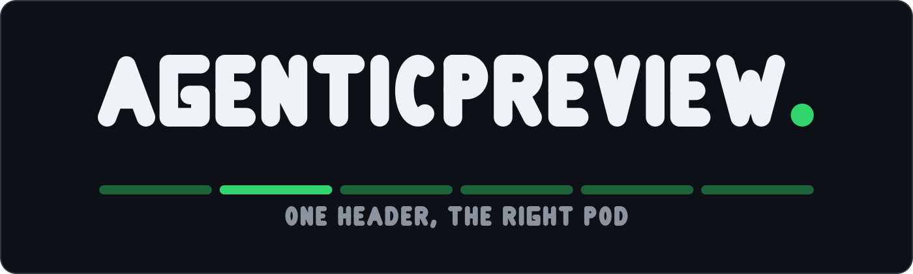
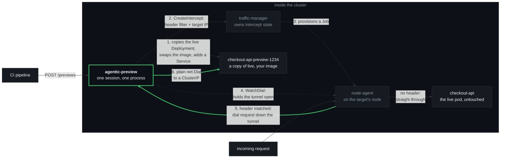

<p align="center">
  
</p>

<p align="center">
  <a href="#licence"></a>
  
  
</p>

---

`agentic-preview` raises header-routed [Telepresence](https://www.telepresence.io/)
previews from an HTTP call: POST it a work id, a service and an image, and it builds the
preview and diverts every request carrying that header value to it. It runs as an
ordinary Deployment inside the cluster — no Telepresence CLI, no connector daemon, no TUN
device, no root, no laptop, and no human in the loop.

The preview is a **copy of the live workload** with your image in it. Same environment,
same config and secret references, same pull credentials, same probes, same service
account — because they were copied from the running Deployment rather than guessed at.

Full design notes and measured behaviour: **[`docs/DESIGN.md`](docs/DESIGN.md)**.

---

## The problem it solves

CI builds a pull request. Now someone has to look at it, in a system that means anything —
which means the change has to sit *inside* a real cluster, talking to the real services
around it.

The usual answers are all bad in the same way. Give the branch its own namespace and you
have cloned a whole estate to look at one service. Give it its own ingress hostname and
everything downstream still points at live. Wait for a shared staging slot and only one
change can be in flight at a time.

Header routing is the answer that scales: leave everything live, and divert *only* requests
carrying a chosen header to the changed service. Telepresence already does exactly this —
but through a CLI that runs on a developer's laptop, holding a session over a TUN device
and needing root to do it. A pipeline cannot drive that. So it stays a manual, interactive,
one-person-at-a-time tool.

`agentic-preview` is the same mechanism with the laptop taken out. One `POST` from a
pipeline step builds the preview and makes the header live; one `DELETE` when you are
finished with it and both are gone.

**And it holds a change together across repositories.** A work id — whatever id your issue
tracker gives one piece of work — is the primary key *and* the header value. The API, the
worker and a shared library land as three separate PRs, each joining the same work id as it
builds, and one header reaches all three. That is the thing a PR number cannot do.

## How it works

**Start with the one design fact, because nothing else makes sense without it.**

`InterceptSpec.target_host` reads like an address the traffic-agent connects to. **It is
not. The agent never dials it.**

For each intercepted request, the traffic-agent opens a tunnel back to the *client session*
and sends the destination down it as part of the connection ID. The dial happens at the
**client's** end, with a plain `net.Dial`. So the destination of a preview is not a value
you hand the manager — it is *a process holding a session and answering dial requests*.

That is the whole trick. Put that process **in the cluster** and its `net.Dial` reaches any
ClusterIP. The laptop, the TUN device and the root privileges were never about routing —
they were only ever about getting a dial to the right side of the network. In-cluster,
there is nothing to tunnel *to*; you are already there.

Two consequences fall straight out of it:

- **It must be long-lived.** A one-shot API call cannot be the far end of a tunnel. The
  service holds one manager session for its whole life, and every preview reconciles onto
  that session.
- **`target_host` must be a literal IP.** The agent parses it with `iputil.ParseAddr` and
  fails the intercept on a name, so agentic-preview resolves the preview Service by DNS
  itself before creating the intercept.



Step 6 is the one worth re-reading. The dial to the preview happens *in agentic-preview's
own process*, from inside the cluster — which is why no tunnelling, no routing table and
no privilege is involved anywhere.

Step 1 is the other one. **The preview is built from the live workload, not from a
template.** Read the running Deployment, deep-copy its pod template, put the caller's
image on the chosen container, set the replica count, relabel it so nothing else in the
namespace can claim it, and create it. Everything a pod needs to actually run — its
environment, its `envFrom` ConfigMap and Secret references, its volumes, its
`imagePullSecrets`, its probes, its resources, its service account — comes across because
it was copied, not because anybody enumerated it.

That is not a tidy implementation choice, it is the lesson. Three earlier attempts built
the preview from a template instead and failed three different ways: an image reference
that did not resolve, no credentials to pull a private image, and a pod that started and
died on the spot because it had none of the live configuration. Anything invented rather
than copied is a fourth way to fail.

## Feature map

```mermaid
flowchart TB
    ROOT(["agentic-preview"])

    ROOT --> B
    ROOT --> R
    ROOT --> D
    ROOT --> L
    ROOT --> S
    ROOT --> O

    subgraph B["Building"]
        direction TB
        B1["Preview is a COPY of<br/>the live Deployment"]
        B2["Env, config, secrets, pull<br/>creds, probes, SA carried"]
        B3["Image taken verbatim:<br/>no tag conventions"]
        B4["Refuses to build a pod<br/>live traffic could claim"]
    end

    subgraph R["Routing"]
        direction TB
        R1["One header reaches<br/>a whole change"]
        R2["Many services per id,<br/>joined as each PR builds"]
        R3["Header name is service<br/>config, not per-request"]
        R4["Two work ids, one<br/>workload, at once"]
    end

    subgraph D["Durability"]
        direction TB
        D1["Survives a target-pod<br/>rollout"]
        D2["Survives a manager<br/>restart"]
        D3["Re-raises previews onto<br/>a rebuilt session"]
        D4["One tunnel per agent pod,<br/>not per preview"]
    end

    subgraph L["Lifecycle"]
        direction TB
        L1["POST is idempotent:<br/>retries roll it forward"]
        L2["Teardown is explicit;<br/>a merge is not a trigger"]
        L3["Lifetime safety net,<br/>switchable off"]
        L4["Drop one service, or<br/>a whole work id"]
    end

    subgraph S["Safety"]
        direction TB
        S1["Allow-list bounds intercept,<br/>build AND forward target"]
        S2["Bearer SA token,<br/>re-read every call"]
        S3["Session credential for<br/>a verified WatchDial"]
        S4["Deletes and overwrites only<br/>what carries its own label"]
    end

    subgraph O["Operability"]
        direction TB
        O1["/readyz reports session<br/>and every tunnel"]
        O2["Refusals name the field<br/>to fix"]
        O3["Reports image, age<br/>and expiry per preview"]
        O4["Namespaced RBAC only,<br/>never cluster-wide"]
    end

    classDef root fill:#0d1117,stroke:#32d46d,stroke-width:3px,color:#f0f3f6
    classDef leaf fill:#161b22,stroke:#30363d,stroke-width:1px,color:#f0f3f6
    class ROOT root
    class B1,B2,B3,B4,R1,R2,R3,R4,D1,D2,D3,D4,L1,L2,L3,L4,S1,S2,S3,S4,O1,O2,O3,O4 leaf
    style B fill:#0d1117,stroke:#32d46d,stroke-width:2px,color:#32d46d
    style R fill:#0d1117,stroke:#32d46d,stroke-width:2px,color:#32d46d
    style D fill:#0d1117,stroke:#32d46d,stroke-width:2px,color:#32d46d
    style L fill:#0d1117,stroke:#32d46d,stroke-width:2px,color:#32d46d
    style S fill:#0d1117,stroke:#32d46d,stroke-width:2px,color:#32d46d
    style O fill:#0d1117,stroke:#32d46d,stroke-width:2px,color:#32d46d
```



## How to deploy it

**Prerequisite:** a Telepresence traffic-manager already running in the cluster, v2.30.0 or
later. The node-agent reconciler that makes a preview survive a target-pod rollout landed
in v2.30.0; earlier managers will raise an intercept but lose it on the first roll.
agentic-preview does not install Telepresence — see
[the Telepresence install docs](https://www.telepresence.io/docs/install/manager).

**1. Build and push the image.**

```bash
docker build -t registry.example.com/agentic-preview:$(date +%Y%m%d).01 .
docker push  registry.example.com/agentic-preview:$(date +%Y%m%d).01
```

A static binary on `distroless/static-debian12:nonroot`. The Telepresence dependency is
pinned to an exact commit in `go.mod` and fetched from the module proxy, so no local
Telepresence checkout is needed.

**2. Replace the four placeholders in `deploy/`.** They are listed, with what each one is
and where it appears, in the header comment of
[`deploy/kustomization.yaml`](deploy/kustomization.yaml):

| Placeholder | Replace with |
| :--- | :--- |
| `telepresence` | The namespace your traffic-manager runs in — `kubectl get deploy -A \| grep traffic-manager` |
| `shop` | Each namespace agentic-preview may intercept in, build previews in, and forward to |
| `registry.example.com/agentic-preview` | Where you pushed the image |
| `agentic-preview` (namespace) | Where the service itself should run, if not there |

`shop` and `checkout-api` throughout this repo are a **fictional example service**, not a
default worth keeping.

Three things have to name the same set of namespaces for the life of the deploy: the
**attach** Roles in `deploy/rbac.yaml`, the **build** Roles beside them, and
`ALLOWED_NAMESPACES` in `deploy/deployment.yaml`. They bound three different ends of a
preview — intercepting, building, and forwarding — and the third is bounded by that env var
and nothing else. The reason is in [Honest limits](#honest-limits) and it matters.

**What the permissions allow, in one paragraph.** In the listed namespaces and nowhere
else: `get`, `list`, `create`, `update` and `delete` on Deployments and Services, and
`list` on Pods. Never a ClusterRole. Nothing on ConfigMaps or Secrets — the preview
*references* the live ones, it never reads their contents. Every verb is accounted for
line by line in [`deploy/rbac.yaml`](deploy/rbac.yaml), and `update` and `delete` are both
guarded in code by the tool's own `app.kubernetes.io/managed-by` label, so an object it
did not create is never written to and never removed.

**3. Apply it.**

```bash
kubectl apply -k deploy/
kubectl -n agentic-preview rollout status deploy/agentic-preview
```

It is ready only once a manager session exists, so a green `/readyz` means it can actually
raise something:

```bash
kubectl -n agentic-preview port-forward svc/agentic-preview 8080:80
curl -sS localhost:8080/readyz
```

## How to call it

```
POST   /previews                                  build a preview of one service and
                                                  route its header
GET    /previews                                  every work id, what it spans, what
                                                  image each runs, age and expiry
GET    /previews/{workId}                         one work id's service set
DELETE /previews/{workId}/{namespace}/{workload}  remove one service of a work id
DELETE /previews/{workId}                         remove a whole work id
GET    /healthz                                   liveness
GET    /readyz                                    ready only once a session exists
```

**Raise a preview.** One call: build it, and route to it.

```bash
curl -XPOST http://agentic-preview.agentic-preview.svc.cluster.local/previews \
  -H 'content-type: application/json' \
  -d '{"workId":"1234","workload":"checkout-api","namespace":"shop",
       "image":"registry.example.com/checkout-api:pr-1234","port":"http"}'
```

That reads the live `checkout-api` Deployment in `shop`, copies it with that image in
place of the live one, creates `checkout-api-preview-1234` and a Service in front of it,
waits for the pods to actually come up, and then raises the intercept. If the pods do not
come up you get the reason — `ErrImagePull: manifest unknown`, `ImagePullBackOff` — and no
intercept, rather than a header that hangs.

| Field | Meaning |
| :--- | :--- |
| `workId` | **required** — any string you pick. The header value, and the key everything is grouped under. Never parsed. |
| `workload` | **required** — the live Deployment to copy and to intercept. |
| `namespace` | **required** — where it lives. Must be in `ALLOWED_NAMESPACES`. |
| `image` | The image to run, **verbatim**. Setting it is what asks for a preview to be built. |
| `replicas` | How many preview pods. Default 1, maximum 10. |
| `container` | Which container's image to swap. Only needed when the pod has several and none is named after the workload. |
| `sourceService` | The live Service whose ports are copied. Defaults to `workload`. |
| `port` | The port identifier on the *live* workload — a service port name or number. Default `80`. |
| `previewService` | Instead of `image`: route to a Service **you** deployed. The two are mutually exclusive. |

**Reach it** through the cluster's normal ingress, with the header:

```bash
curl -H 'x-preview: 1234' https://your-ingress/checkout
```

Anything without that header goes to the live pod, unchanged and unaware. POSTing the same
work id again **adds** a service to it. POSTing the same work id *and* service with the
same image is a no-op (`"unchanged"`), so a pipeline retry is safe; with a **new** image it
rolls the Deployment forward in place and leaves the intercept alone (`"rolled"`), so a new
commit is one call and no gap in routing.

**Tear it down when you are finished with it** — which is not the same as when the PR
merged:

```bash
curl -XDELETE http://agentic-preview.agentic-preview.svc.cluster.local/previews/1234
```

That removes the intercepts *and* the Deployments and Services agentic-preview built,
found by the labels it put on them — so it works even after the service has restarted and
forgotten what it raised.

**Still want to deploy the preview yourself?** Send `previewService` instead of `image`
and nothing is built; agentic-preview does the intercept half only, exactly as it did
before it could build anything. That is the right shape when the preview is not a copy of
one live Deployment.

Runnable versions of all five operations are in **[`examples/`](examples/)**. They are
plain `curl`; the API is small enough that a wrapper would only hide it.

## A worked example, end to end

The pattern, with a fictional `checkout-api` in a namespace called `shop` and a made-up
work id of `1234`. Substitute your own — and note that `1234` is *any string you like*: an
issue number, a branch name, `blue-widget`, somebody's initials. agentic-preview uses it as
the header value and as a label, and never reads anything out of it.

**1. Somebody opens a pull request** against `checkout-api`.

**2. Your existing CI builds the service's image.** It almost certainly does this already —
building the image is how most pipelines run their tests against the real artifact — and
then throws it away. *That is the insight that makes this cheap.* You are not adding a
build; you are keeping one you were already paying for. Whatever you run this in — GitHub
Actions, GitLab CI, Jenkins, Buildkite, a shell script on a box — is where step two already
happens. None of them is required; agentic-preview never sees this step.

**3. Push that image with a tag carrying an id of your choosing.** `pr-1234`,
`branch-blue-widget`, whatever your conventions are. The shape of that tag is entirely
yours: agentic-preview never reads it, never parses it, and never assumes a registry.

**4. Call this tool** with the service, the namespace, that id and that image:

```bash
curl -XPOST http://agentic-preview.agentic-preview.svc.cluster.local/previews \
  -H 'content-type: application/json' \
  -d '{"workId":"1234","workload":"checkout-api","namespace":"shop",
       "image":"registry.example.com/checkout-api:pr-1234","port":"http"}'
```

It copies the live `checkout-api`, runs your image with the live configuration, puts a
Service in front of it, and makes the header live. If the change spans more repositories,
each one calls this as it builds, with the same `workId` — and one header then reaches all
of them.

**5. A request carrying the header reaches the preview. Everything else reaches live.**

```bash
curl -H 'x-preview: 1234' https://your-ingress/checkout   # the PR build
curl                      https://your-ingress/checkout   # live, untouched
```

**6. When you are finished with it, something calls `DELETE`** and the preview goes.

```bash
curl -XDELETE http://agentic-preview.agentic-preview.svc.cluster.local/previews/1234
```

**A merge is deliberately not the trigger**, and this is the assumption most readers arrive
with. You may well still be testing against the preview after the branch has merged —
comparing behaviour, reproducing something, showing somebody. Teardown is explicit:
somebody asks, and it goes. The only thing that removes a preview on its own is the
lifetime safety net below, and that can be switched off.

### Which of those six steps are this tool

**Four and five.** Building the preview from the live workload, creating it, routing the
header to it, and forwarding the traffic — that is agentic-preview, and that is all of it.

**One, two, three and six are yours.** Opening the pull request, building the image,
pushing it under a tag you chose, and deciding when you are done with the preview. Step
three's tag shape in particular is entirely yours: the tool receives a reference and runs
it. *Triggering is the adopter's job; the tool only receives calls.*

## What it deliberately does not do

These are the boundaries, not gaps waiting to be filled. Most of them exist because the
alternative would only ever be right for one company's pipeline.

- **It does not trigger anything.** It receives calls. Nothing here watches a repository,
  a registry, a webhook or a queue. *Triggering is the adopter's job* — you already have
  something that knows when a build finished, and it knows far more about your process than
  this could.
- **It knows nothing about how an image came to exist, or what its tag means.** You give it
  an image reference and it runs that reference, verbatim. It does not complete a bare tag
  against the live container's registry, does not read an id or a branch or a commit out of
  a tag, and assumes no registry. A tool that guessed at tag conventions would be wrong
  everywhere but the one place it was written.
- **It has no notion of a pull request.** Not opened, not merged, not closed. A work id is
  an opaque string used as the header value and as a label — never parsed. Nothing tears a
  preview down because a branch merged; see the lifetime note below for the only thing that
  removes a preview on its own.
- **It does not build or push images.** Your CI already does.
- **It does not manage DNS, ingress or certificates.** Traffic arrives through the ingress
  you already have; the header is the only thing that changes.
- **It does not accept a per-request header name.** `HEADER_NAME` is service-level
  configuration. Two services of one work id behind different header names would destroy
  the one guarantee a work id exists for.
- **It does not scale out.** Exactly one replica, `strategy: Recreate`. Two replicas would
  each arrive as their own session and collide raising identical header filters rather than
  sharing the work.
- **It does not authenticate its callers.** ClusterIP, no Ingress, no API key. Anything
  that can reach it can raise a preview — and now, build one. Put it where only your
  pipeline can reach it.
- **It does not touch the cluster outside the namespaces on its allow-list**, and holds no
  ClusterRole at all.
- **It does not install or manage Telepresence.**

## Honest limits

All of these are worth reading *before* you deploy it, not after. The first three were true
when it only did routing; the rest arrived with its ability to create workloads, which is
the part with consequences that outlive the request.

**A forced kill leaves headers hanging, and it does not fail open.** On `SIGTERM` — every
rollout, scale-down, drain and eviction — the service removes each intercept and departs
its session first; measured, every header falls straight through to the live pod in under
0.31s with no node-agent Jobs left behind. On a `SIGKILL` it cannot. The intercepts stay in
manager state with nobody holding their tunnel, and **requests carrying those headers
hang.** The agent's fail-open branch covers a *broken* client stream, not an *absent* one:
with no dial watcher at all it retries on a constant 20ms backoff with no maximum elapsed
time and never reaches the fail-open path. Measured twice — no response after 15s and after
90s, while unmarked traffic served normally in 1.5s.

The damage is narrow and it is worth being precise about: only the *specific header value*
is affected. No other traffic is touched, and nobody gets a wrong answer. The next `POST`
for that service clears it — the manager's conflict error names the dead session, and
agentic-preview departs it and retries once, releasing everything that session held.

**There is a window during a target-pod rollout.** When the workload you are previewing
rolls, the manager reaps the old node-agent Job and provisions one for the new pod, and
agentic-preview rebuilds its tunnel to it. That recovers on its own — but there is a gap
first: **18s in the measured run.** Requests carrying a preview header in that window hang
rather than falling back to live, for the same reason as above. Unmarked traffic is
unaffected throughout.

**`ALLOWED_NAMESPACES` is the only fence on the forward target.** This is the one to
understand properly. A preview has three ends, and they are *not* bounded by the same
thing:

- The end that **intercepts** is authorized by Kubernetes. The attach Roles in
  `deploy/rbac.yaml` are what the traffic-manager reviews before it will let this service
  intercept a workload.
- The end that **builds** is authorized by Kubernetes too, and this one is enforced
  whatever the manager is doing. The build Roles in `deploy/rbac.yaml` are namespaced, so
  even if the in-process check were wrong, the API server would refuse a create outside the
  listed namespaces. The in-process check is still there, and states the same boundary at
  the point of use.
- The end that **forwards** is not authorized by anything. It is a plain `net.Dial` from
  this pod to a ClusterIP, and no Kubernetes permission is consulted for it. No Role can
  bound it, because Kubernetes is not in that path at all.

So the in-process check against `ALLOWED_NAMESPACES` is the *only* thing standing between a
caller and forwarding intercepted production traffic to any Service anywhere in the
cluster. It is checked in every direction and required with no default — an empty list read
as "everything" is the wrong failure — and the refusal names *which* namespace it means,
because they are different request fields and a vague message sends a caller to change the
wrong one. Keep both sets of Roles and the env var naming the same set.

**One more thing worth saying plainly about the build permissions.** `delete` on
Deployments in a namespace is `delete` on *any* Deployment in that namespace; RBAC cannot
be narrowed by label. What narrows it is the code: every delete first *lists* by the tool's
own `managed-by` label, then re-checks that label on each object before naming it, and
deletes by name — never `deletecollection`, never a selector the API server could interpret
more widely than intended. `update` is guarded the same way, so an object the tool did not
create is never written to either. Both guards have tests. The namespace boundary is
Kubernetes’; the "only its own objects" boundary is this code’s, and it is stated here
rather than assumed.

**A preview can be built and still not run, and the pod is what tells you.** Creating a
Deployment always succeeds; whether its pods start is a separate question answered ten
seconds later. So a create waits — `PREVIEW_READY_TIMEOUT`, 120s by default — and if the
pods have not come up it fails the `POST` with the reason Kubernetes gives, and raises no
intercept. That is deliberate: an intercept pointed at a Service with no endpoints turns a
broken build into a hanging header, which is a far worse way to find out. The three
failures this design exists to avoid — an image reference that does not resolve, no
credentials to pull it, a pod that dies instantly for want of configuration — all surface
here as `ErrImagePull`, `ImagePullBackOff` or a crash loop. **The objects are left in place
so you can look at them**; `DELETE /previews/{workId}` clears them.

**The preview's pod labels are copied from live, and that is a hazard the tool refuses
rather than manages.** A copied pod template carries every label the live pods carry,
including whatever the live Service selects on. A preview pod that still matches it joins
the live EndpointSlice, and unreviewed code serves live traffic to everybody, silently. So
before creating anything, agentic-preview checks the preview's pod labels against the
selector of **every** Service in the namespace and refuses if any of them would claim it.
It overrides `app` and adds its own unique label, which covers the ordinary case; a
workload whose Service selects on something else entirely gets a refusal naming the
Service and the selector, and you either change what that Service selects on or deploy the
preview yourself with `previewService`. It will not create a pod it cannot prove is
isolated.

**There is a timer against forgotten previews, and you may well want it off.**
`PREVIEW_LIFETIME` sweeps a work id that nothing has touched for 24 hours — intercepts and
created objects together, by the same path a `DELETE` takes. Any contact with an id —
raising a service under it again, adding another — puts the whole id back to a full
lifetime, because a work id is one change and its services are used together. `GET
/previews` reports each preview's age and, when a lifetime is set, exactly when it expires,
so an expiry is visible *before* it happens and can be extended rather than discovered
afterwards.

24 hours is the default because it is the safe answer for somebody with nobody minding
their cluster. **If something else is responsible for cleaning previews up, turn it off** —
`PREVIEW_LIFETIME: off` — because a timer that removes a preview while somebody is still
testing against it is worse than a forgotten pod. Off is an explicit choice on purpose:
leave the configuration alone and you get the timer. With expiry off, the age in
`GET /previews` is what a person or a supervising process reviews instead.

**A restart puts previews out of the timer's reach, and the labels are the answer to
that.** The record of what is live is in memory, so a restarted process no longer knows
about the previews its predecessor raised — and will not expire them. It has not lost them,
though: everything it creates carries `app.kubernetes.io/managed-by=agentic-preview` and
the work id, so a stray is always findable and always removable —

```bash
kubectl get deploy,svc -A -l app.kubernetes.io/managed-by=agentic-preview
curl -XDELETE .../previews/1234    # goes by label, not by memory
```

— and re-POSTing the same work id adopts the existing objects and rolls them forward rather
than colliding with them. It is a real gap all the same: after a restart, cleanup is
somebody asking, not a timer. Previews are also **not** removed on `SIGTERM`, deliberately —
destroying every preview in the cluster on each rollout of this service would be its own
outage.

**If you expire preview images, exclude the ones in use.** `GET /previews` reports the
image each preview it built is running, precisely so an image-retention policy can skip
them. A preview that outlives its image keeps working until its pod is replaced — a node
drain, an eviction, a rollout — and then cannot pull, and the failure looks like a fault in
this service. It is not one. agentic-preview deliberately knows nothing about image
retention; it just tells you what is in use.

A smaller one: **`GetSessionCredential` may not exist on your manager.** It landed
after the v2.31.1 release tag. agentic-preview calls it, logs the `Unimplemented`, and
carries on with unverified agent calls, which permissive agents accept. An enforcing agent
would require it.

## Repository layout

| Path | What it holds |
| :--- | :--- |
| `main.go` | HTTP server, signal handling, shutdown ordering |
| `config.go` | Environment configuration; `ALLOWED_NAMESPACES` is the boundary |
| `preview.go` | Work ids, the service set under each, request validation, name resolution, expiry |
| `workload.go` | Building the preview from the live Deployment, the isolation check, label-scoped delete |
| `kube.go` | The entire Kubernetes surface this service uses, as one interface — the RBAC grants exactly this |
| `session.go` | Manager session: arrive, remain, credential, reconnect, raise/remove, orphan sweep |
| `agents.go` | One tunnel per node-agent pod, rebuilt as the agent pod set changes |
| `api.go` | The HTTP API |
| `deploy/` | Deployment, Service, ServiceAccount, RBAC, kustomization — four placeholders |
| `examples/` | Raise (built or your own), list, drop one, drop all — runnable `curl` |
| `docs/DESIGN.md` | Design notes, RBAC detail, and the measured behaviour behind the claims above |
| `brand/` | The mark, and the generator that draws it |

### Configuration

Everything comes from the environment, so the Deployment manifest is the single place it is
set.

| Variable | Default | What it is |
| :--- | :--- | :--- |
| `MANAGER_ADDR` | **required** | The traffic-manager's gRPC address. No default: the namespace Telepresence was installed into varies, and a wrong guess fails as an unhelpful dial timeout. |
| `ALLOWED_NAMESPACES` | **required** | Comma-separated. The boundary, in both directions. No default. |
| `HEADER_NAME` | `x-preview` | The single header every preview is routed on. Its *value* is the work id. |
| `LISTEN_ADDR` | `:8080` | Where the HTTP API listens. |
| `CLIENT_NAME` | `agentic-preview` | The client name the manager records. The orphan sweep only ever evicts sessions bearing this name. |
| `STATE_FILE` | `/var/lib/agentic-preview/session` | Best-effort record of the current session id, departed on startup. |
| `TOKEN_FILE` | the projected SA token path | The bearer token presented to the manager. |
| `REMAIN_INTERVAL` | `20s` | How often `Remain` holds the session open. |
| `RECONNECT_BACKOFF` | `5s` | Pause before rebuilding a dead session. |
| `AGENT_RECONCILE_INTERVAL` | `10s` | How often the agent-pod set is re-reconciled without a new snapshot. |
| `PREVIEW_LIFETIME` | `24h` | How long a preview lives untouched before it is swept. Any contact with a work id extends every preview in it. `off`, `never` or `0` disables expiry — do that when something else is responsible for cleaning up. |
| `PREVIEW_REAP_INTERVAL` | `1m` | How often expired previews are swept. |
| `PREVIEW_READY_TIMEOUT` | `120s` | How long a create waits for the preview's pods before failing the `POST` with the reason. `0` skips the wait. |

### Building and testing

No local Go toolchain needed:

```bash
docker run --rm -v "$PWD":/src -w /src golang:1.27-alpine \
  sh -c 'gofmt -l . && go vet ./... && go build ./... && go test ./...'
```

### The mark

`brand/make.py` is the source of truth. It sets the wordmark in
[Glyphsmith](https://github.com/Alchemy86/Glyphsmith)'s house alphabet — no embedded font,
no traced outlines — and writes both SVGs; re-running it reproduces them byte for byte.

```bash
pip install --user git+https://github.com/Alchemy86/Glyphsmith
python3 brand/make.py
```

`brand/agentic-preview-logo.png` is a **derived artifact**, committed only because GitHub
cannot render an SVG in a pull request or issue body. Regenerate it whenever the SVG
changes:

```bash
magick -background none brand/agentic-preview-logo.svg \
  -resize 1400x -depth 8 -strip brand/agentic-preview-logo.png
```

## Licence

**Apache License 2.0** — see [`LICENSE`](LICENSE) and [`NOTICE`](NOTICE).

That choice is not arbitrary. agentic-preview embeds the Telepresence Go client: `rpc/v2`
for the manager and agent gRPC stubs, and `pkg/tunnel` for the dial loop that is the whole
forwarder. Telepresence is licensed **Apache 2.0**, whose terms for redistributing a work
that includes it are to keep the licence and attribution notices intact, state any changes,
and pass the licence along. Taking the same licence satisfies all of that with no
compatibility question to argue about, and carries the same explicit patent grant the
dependency already relies on. agentic-preview links those packages unmodified; the `NOTICE`
file records the attribution.

The rest of the dependency graph is permissive too — Apache-2.0, MIT and BSD-3-Clause
across gRPC, protobuf, the `k8s.io` client libraries, `quic-go`, `uuid` and the `golang.org/x`
packages. Nothing copyleft, and nothing that constrains the choice above.
